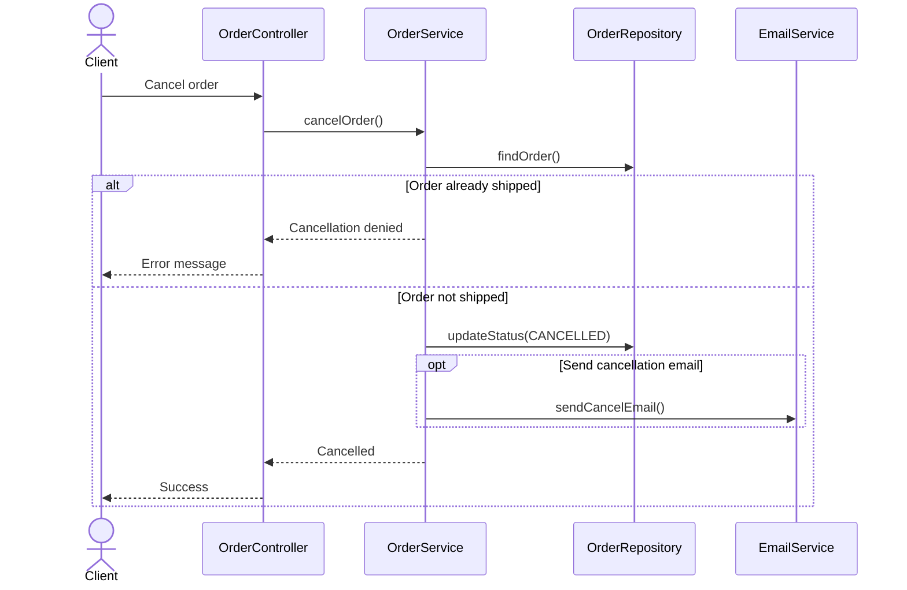

```mermaid
sequenceDiagram
    actor Client
    participant Controller as OrderController
    participant Service as OrderService
    participant Repo as OrderRepository
    participant Email as EmailService

    Client->>Controller: Cancel order
    Controller->>Service: cancelOrder()

    Service->>Repo: findOrder()

    alt Order already shipped
        Service-->>Controller: Cancellation denied
        Controller-->>Client: Error message
    else Order not shipped
        Service->>Repo: updateStatus(CANCELLED)

        opt Send cancellation email
            Service->>Email: sendCancelEmail()
        end

        Service-->>Controller: Cancelled
        Controller-->>Client: Success
    end
```
