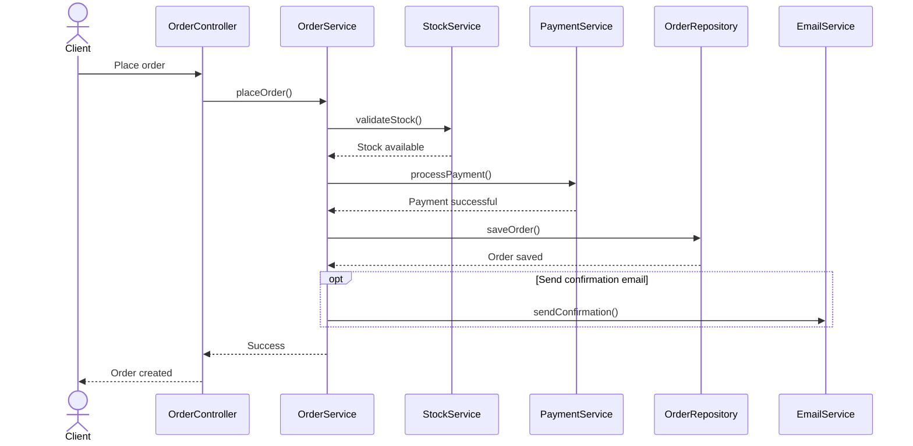

```mermaid
sequenceDiagram
    actor Client
    participant Controller as OrderController
    participant Service as OrderService
    participant Stock as StockService
    participant Payment as PaymentService
    participant Repo as OrderRepository
    participant Email as EmailService

    Client->>Controller: Place order
    Controller->>Service: placeOrder()

    Service->>Stock: validateStock()
    Stock-->>Service: Stock available

    Service->>Payment: processPayment()
    Payment-->>Service: Payment successful

    Service->>Repo: saveOrder()
    Repo-->>Service: Order saved

    opt Send confirmation email
        Service->>Email: sendConfirmation()
    end

    Service-->>Controller: Success
    Controller-->>Client: Order created
```
